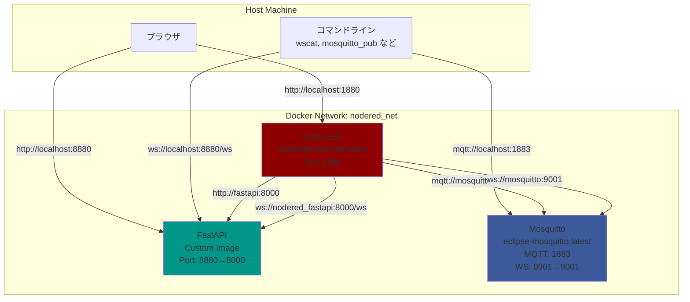
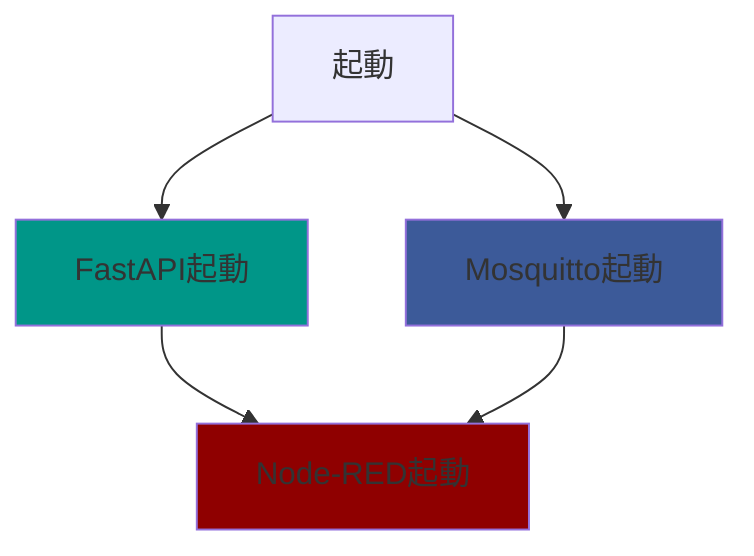

# アーキテクチャ

このドキュメントでは、Node-RED学習環境のコンテナ構成とネットワークアーキテクチャを説明します。

## システム構成



## コンテナ一覧

| コンテナ | イメージ | 役割 | ポート（ホスト→コンテナ） |
|---------|---------|------|------------------------|
| **nodered** | nodered/node-red:latest | フロー開発環境 | 1880→1880 |
| **nodered_fastapi** | カスタムビルド | REST API / WebSocket | 8880→8000 |
| **mosquitto** | eclipse-mosquitto:latest | MQTTブローカー | 1883→1883, 9901→9001 |

## ネットワーク

### ブリッジネットワーク: `nodered_net`

すべてのコンテナは同一のブリッジネットワークに接続されており、コンテナ名で相互に通信できます。

### コンテナ間通信

Node-REDから他のサービスへの接続：

```
Node-RED → FastAPI:     http://fastapi:8000
Node-RED → FastAPI WS:  ws://nodered_fastapi:8000/ws
Node-RED → MQTT:        mqtt://mosquitto:1883
Node-RED → MQTT WS:     ws://mosquitto:9001
```

### ホストからのアクセス

```
Node-RED UI:      http://localhost:1880
FastAPI:          http://localhost:8880
FastAPI Docs:     http://localhost:8880/docs
MQTT:             mqtt://localhost:1883
MQTT WebSocket:   ws://localhost:9901
```

## ボリュームマウント

- **Node-RED**
  - `docker/data/` → `/data` - フロー、設定、インストール済みノード
  - `docker/hostfiles/` → `/hostfiles` - ホストとの共有ファイル
  - `custom-nodes/` → `/custom-nodes` - 開発中のカスタムノード

- **FastAPI**
  - `docker/fastapi/app/` → `/app` - アプリケーションコード（ライブリロード対応）

- **Mosquitto**
  - `docker/mosquitto/config/` → `/mosquitto/config` - 設定ファイル
  - `scripts/simulation/mosquitto/` → `/scripts` (read-only) - シミュレーションスクリプト

## サービス依存関係



Node-REDはFastAPIとMosquittoの起動完了を待ってから起動します（`depends_on`設定）。

## 環境変数

主要な設定は`.env`ファイルでカスタマイズ可能：

| 変数 | デフォルト | 説明 |
|------|-----------|------|
| `NODERED_PORT` | 1880 | Node-REDのホストポート |
| `FASTAPI_PORT` | 8880 | FastAPIのホストポート |
| `MQTT_PORT` | 1883 | MQTTのホストポート |
| `MQTT_WS_PORT` | 9901 | MQTT WebSocketのホストポート |
| `TZ` | Asia/Tokyo | タイムゾーン |

詳細は[README.md](../README.md)の「設定」セクションを参照してください。

## 起動・停止

```bash
# 起動
./scripts/start.sh

# 停止
./scripts/stop.sh

# リセット（全データ削除）
./scripts/reset.sh
```

## 関連ドキュメント

- [README.md](../README.md) - プロジェクト全体の概要
- [CLAUDE.md](../CLAUDE.md) - 詳細なアーキテクチャ情報
- [基本的なフローの例](example-basic.md) - Node-REDの基本操作
