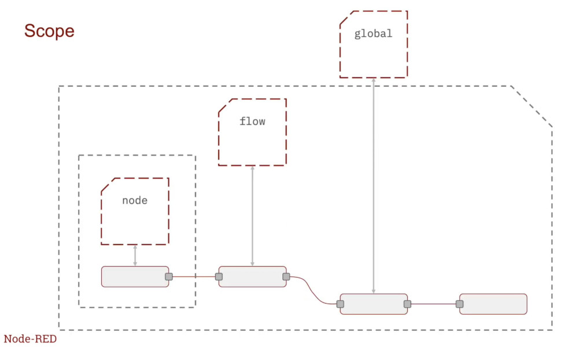

# 基本的なフローの例

このドキュメントでは、Node-REDの基本的なフローの構成方法を説明します。`examples/basic_flow.json`に含まれる3つの基本的な例を通じて、Node-REDの基礎を学ぶことができます。

## 概要

このサンプルフローには、Node-REDを使う上で重要な以下の3つの基本的な例が含まれています：

1. **Hello World例** - メッセージをそのまま出力
2. **Functionノード例** - データの変換と処理
3. **コンテキスト使用例** - ノード間でのデータ共有

## 前提条件

- Node-REDが起動していること（`./scripts/start.sh`）
- Node-RED UIにアクセス可能なこと（http://localhost:1880）

## サンプルフローのインポート

1. `examples/basic_flow.json`の内容をコピー
2. Node-REDのメニュー（☰）→「インポート」を選択
3. JSONを貼り付けて「インポート」をクリック
4. デプロイ

## 例1: Hello World

### 概要

最もシンプルな例として、Injectノードから送信したメッセージをそのままDebugノードで表示します。

### フロー構成

```
[inject] → [debug]
```

### ノードの説明

1. **Injectノード**
   - `payload`: `"Hello, world"`（文字列）
   - `topic`: `"hello_world/input_text"`
   - ボタンをクリックするとメッセージを送信

2. **Debugノード**
   - 受信したメッセージをデバッグサイドバーに表示

### 動作確認

1. Injectノードのボタンをクリック
2. デバッグサイドバーで `"Hello, world"` というメッセージが表示されることを確認

### 学習ポイント

- Injectノードでメッセージを手動で生成する方法
- Debugノードでメッセージを確認する方法
- `msg.payload`と`msg.topic`の基本的な使い方

## 例2: Functionノードによるデータ変換

### 概要

Injectノードからエポックタイムスタンプ（ミリ秒）を送信し、Functionノードで人間が読める形式の文字列に変換します。

### フロー構成

```
[inject] → [function] → [debug]
          ↓
        [debug]
```

### ノードの説明

1. **Injectノード**
   - `payload`: タイムスタンプ（`date`型）
   - ボタンをクリックすると現在時刻のエポックミリ秒を送信

2. **Functionノード（epoch → string）**
   - エポックミリ秒を受け取り、日時文字列に変換
   - 変換後のメッセージを次のノードへ送信

3. **Debugノード**
   - 上側: 元のエポックミリ秒を表示（変換前）
   - 下側: 変換後の日時文字列を表示

### 動作確認

1. Injectノードのボタンをクリック
2. デバッグサイドバーで以下を確認：
   - エポックミリ秒（例: `1731830400000`）
   - 日時文字列（例: `"2024/11/17 18:00:00"`）

### 学習ポイント

- Functionノードでの基本的なJavaScript処理
- `msg.payload`の読み取りと更新
- 同じメッセージを複数のノードに分岐する方法
- Dateオブジェクトを使った時刻の処理

## 例3: コンテキストを使ったデータ共有

### 概要

2つの異なるInjectノードからのメッセージを1つのFunctionノードで処理し、コンテキストを使ってデータを共有します。

### フロー構成

```
[inject: ticker（1秒ごと）] ─┐
                             ├→ [function] → [debug]
[inject: テキスト] ──────────┘
```

### ノードの説明

1. **Injectノード（ticker）**
   - `payload`: タイムスタンプ（`date`型）
   - `topic`: `"hello_world/ticker"`
   - **自動送信**: 1秒ごとに自動的にメッセージを送信
   - 役割: 最新の時刻情報を継続的に提供

2. **Injectノード（テキスト）**
   - `payload`: `"現在の時刻をお知らせします"`（文字列）
   - `topic`: `"hello_world/input_text"`
   - 役割: ユーザーが手動でテキストメッセージを送信

3. **Functionノード（timestampつきデータ生成）**
   - tickerから受信した最新時刻をコンテキストに保存
   - テキストを受信したら、保存された最新時刻を付与して出力
   - `msg.topic`によって処理を分岐

4. **Debugノード**
   - タイムスタンプ付きのテキストメッセージを表示

### 動作確認

1. デプロイ後、自動的にtickerが動作開始（デバッグサイドバーには何も表示されない）
2. 「テキスト」Injectノードのボタンをクリック
3. デバッグサイドバーで以下のようなメッセージを確認：
   ```json
   {
     "text": "現在の時刻をお知らせします",
     "timestamp": 1731830450000
   }
   ```

### 学習ポイント

- **コンテキスト**を使った状態の保存と取得（`context.set()`, `context.get()`）
- 1つのFunctionノードで複数の`msg.topic`を処理する方法
- 定期実行（repeatオプション）の使い方
- `node.send()`を使った明示的なメッセージ送信
- `return null`で出力をスキップする方法

## Functionノードの基本パターン

### パターン1: payloadの変換

```javascript
// 入力を変換して返す
msg.payload = transform(msg.payload);
return msg;
```

### パターン2: topicによる処理分岐

```javascript
if (msg.topic === "type1") {
    // type1の処理
    msg.payload = processType1(msg.payload);
    return msg;
}

if (msg.topic === "type2") {
    // type2の処理
    msg.payload = processType2(msg.payload);
    return msg;
}

// 該当しない場合は何も送信しない
return null;
```

### パターン3: コンテキストの使用

```javascript
// 値を保存
context.set("key", value);

// 値を取得
const storedValue = context.get("key");
```

### パターン4: 明示的なメッセージ送信

```javascript
// returnの代わりにnode.send()を使用
node.send({
    topic: "output_topic",
    payload: {
        data: "processed data"
    }
});

// 何も返さない
return null;
```

## コンテキストの種類と使い分け

Node-REDには、データを保存するための3つのスコープのコンテキストがあります。



### Node Context（ノードコンテキスト）

- **スコープ**: 単一のノード内のみ
- **用途**: そのノード専用のデータを保存
- **アクセス方法**: `context.set()`, `context.get()`
- **使用例**: カウンター、前回の値の保存

```javascript
// ノードコンテキストに保存
context.set("counter", 0);
// ノードコンテキストから取得
const counter = context.get("counter");
```

### Flow Context（フローコンテキスト）

- **スコープ**: 同じフロー（タブ）内のすべてのノード
- **用途**: フロー内のノード間でデータを共有
- **アクセス方法**: `flow.set()`, `flow.get()`
- **使用例**: フロー内で共有する設定値、状態情報

```javascript
// フローコンテキストに保存
flow.set("temperature", 25.5);
// フローコンテキストから取得
const temp = flow.get("temperature");
```

### Global Context（グローバルコンテキスト）

- **スコープ**: すべてのフロー（タブ）
- **用途**: アプリケーション全体で共有するデータ
- **アクセス方法**: `global.set()`, `global.get()`
- **使用例**: グローバル設定、共通の状態管理

```javascript
// グローバルコンテキストに保存
global.set("appConfig", {timeout: 30});
// グローバルコンテキストから取得
const config = global.get("appConfig");
```

### コンテキストの選び方

| 状況 | 推奨コンテキスト |
|------|-----------------|
| ノード内だけで使うデータ | Node Context |
| 同じフロー内のノード間で共有 | Flow Context |
| 複数のフロー間で共有 | Global Context |

### よくある質問

#### Q: コンテキストはいつ使う？

コンテキストは、以下のような場合に使用します：

- 複数のメッセージから受信したデータを組み合わせる
- 前回の値と比較する
- カウンターを実装する
- 一時的な状態を保存する
- ノードやフロー間でデータを共有する

## 次のステップ

基本的なフローの構成方法を理解したら、以下のドキュメントで応用例を学ぶことができます：

- [MQTT使用例](example-mqtt.md) - MQTTを使ったセンサーデータの送受信
- [WebSocket使用例](example-websocket.md) - WebSocketを使ったリアルタイム通信
- [Node-RED使い方ガイド](node-red-usage-guide.md) - フローの削除、デプロイタイプなど

## 参考資料

- [Node-RED公式ドキュメント](https://nodered.org/docs/)
- [Functionノードガイド](https://nodered.org/docs/user-guide/writing-functions)
- [コンテキストの使い方](https://nodered.org/docs/user-guide/context)

## 関連ドキュメント

- [README.md](../README.md) - プロジェクト全体の概要
- [Node-RED使い方ガイド](node-red-usage-guide.md) - Node-REDの基本操作
- [カスタムノード開発ガイド](custom-node-development-typescript.md) - カスタムノード開発
