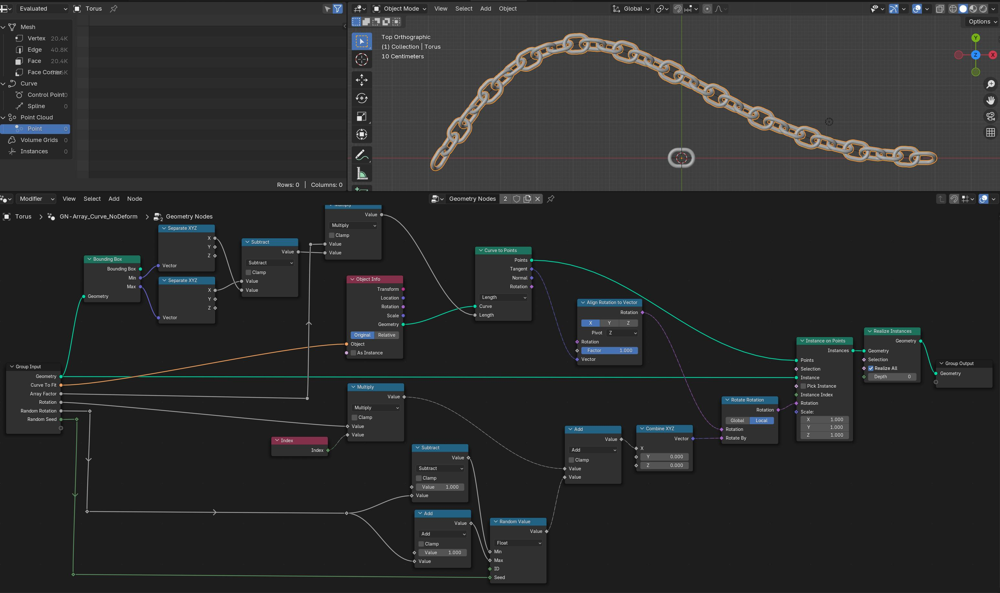
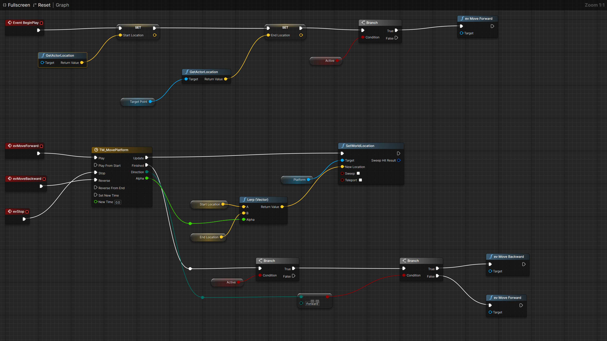

# ノードベースプログラミングの世界へようこそ

## Node-REDとは

Node-REDは、2013年にIBMの新技術研究所で誕生したビジュアルプログラミングツールです。当初はIoT（Internet of Things）デバイスの接続とデータフローの可視化を目的に開発されましたが、その使いやすさと拡張性から、現在では幅広い用途で活用されています。

### オープンソースコミュニティ

Node-REDは2016年にJavaScript Foundationに寄贈され、現在はOpenJS Foundationの一部として、活発なオープンソースコミュニティによって開発が続けられています。世界中の開発者が貢献し、数千もの拡張ノード（パッケージ）が公開されています。

### 軽量性とIoT導入実績

Node.jsをベースに構築されたNode-REDは、Raspberry Piのような小型デバイスでも軽快に動作します。この特性により、以下のような豊富なIoT導入実績があります：

- **スマートホーム**: センサーデータの収集と家電制御
- **産業IoT**: 工場の設備監視と予知保全
- **農業IoT**: 温室の環境モニタリングと自動制御
- **エッジコンピューティング**: センサーエッジでのデータ前処理

## ノードとフローによる視覚的なプログラミング

### 直感的な視覚表現

Node-REDの最大の特徴は、プログラムを「ノード」と「フロー」として視覚的に表現できることです。従来のテキストベースのコードとは異なり：

- **データの流れが一目で分かる**: 左から右へ、上から下へと流れるデータパスを視覚的に追跡
- **処理の全体像を把握しやすい**: システム全体の構成を俯瞰的に理解
- **デバッグが直感的**: どのノードでデータが変化したかを容易に特定

この視覚的アプローチにより、プログラミング初心者でも複雑なロジックを構築でき、経験豊富な開発者にとってもシステムアーキテクチャの理解が容易になります。

### ノード設計とフロー設計の分離

Node-REDのアーキテクチャは、優れた関心の分離を実現しています：

- **ノード設計**: 個別の機能実装に集中（開発者向け）
  - 再利用可能な部品としてのノード
  - テストとメンテナンスが容易
  - npmパッケージとして配布可能

- **フロー設計**: ビジネスロジックの組み立てに集中（ユーザー向け）
  - ノードの内部実装を知らなくても使用可能
  - ドラッグ&ドロップで構築
  - JSONとして保存・共有が可能

この分離により、システムの複雑さを段階的に管理でき、開発者とユーザーそれぞれの役割が明確になります。

### 洗練されたユーザーインターフェース

Node-REDのエディタは、機能性と美しさを両立させた洗練されたデザインです：

- **ダークテーマ対応**: 長時間の作業でも目に優しい
- **スムーズなアニメーション**: ノード接続時の視覚的フィードバック
- **カスタマイズ可能なパレット**: 必要なノードだけを表示
- **レスポンシブデザイン**: タブレットでも快適に操作可能

この「かっこいい」見た目は、単なる装飾ではなく、使いやすさと生産性を向上させる実用的なデザインの結果です。

## なぜノードベースのアプローチを採用すべきか

### ノードの再利用性

一度作成したノードは、プロジェクトを超えて再利用できます：

```
例: MQTT接続ノードを作成
→ 複数のプロジェクトで使い回し
→ チーム全体で共有
→ オープンソースとして公開
```

この再利用性により：
- 開発時間の大幅な短縮
- 品質の向上（テスト済みのノードを使用）
- ベストプラクティスの共有

### ローコード・ノーコード開発

Node-REDは、プログラミング知識のレベルに応じた柔軟な開発スタイルを実現します：

**ノーコード（コード記述なし）**:
- 既存ノードを接続するだけ
- 設定はGUIのフォームから入力
- プログラミング未経験者でも利用可能

**ローコード（最小限のコード）**:
- Function ノードでJavaScriptを少しだけ記述
- 複雑なデータ変換や条件分岐を実装
- 開発効率が飛躍的に向上

**フルコード（必要に応じて）**:
- カスタムノードをJavaScriptで開発
- 高度な機能や外部ライブラリとの統合
- プロフェッショナルな開発にも対応

### エンドユーザーによるカスタマイズ

Node-REDの最も革新的な側面は、エンドユーザーによるカスタマイズを可能にすることです：

**従来のアプローチ**:
```
ユーザーの要望 → 開発依頼 → 開発 → テスト → デプロイ
（数週間〜数ヶ月）
```

**Node-REDのアプローチ**:
```
ユーザー自身がフローを編集 → 即座にデプロイ
（数分〜数時間）
```

この「ユーザーエンパワーメント」により：
- ビジネス要件の変化に迅速に対応
- 開発チームへの依存度を削減
- ユーザー固有のニーズに柔軟に対応

## 他のノードベースツール事例

ノードベースの視覚的プログラミングは、Node-RED以外にも様々な分野で採用されています。

### Blender - ジオメトリノードとシェーダーノード

[Blender](https://www.blender.org/)は、オープンソースの3DCGソフトウェアです。

**ジオメトリノード**:
- プロシージャルモデリングを実現
- パラメータを変更するだけで形状が更新
- 建築物、自然物、抽象的な形状を生成
- ノンデストラクティブな編集が可能

**シェーダーノード**:
- マテリアルの質感を視覚的に定義
- 物理ベースレンダリング（PBR）に対応
- テクスチャ、光の反射、透明度などを組み合わせ
- リアルタイムプレビューで即座に結果確認

**特徴**:
- アーティストがプログラミングなしで複雑な表現を実現
- パラメトリックデザインによる高い柔軟性
- コミュニティによるプリセット共有が活発

**Example**:



### ComfyUI - AI画像生成のワークフロー

[ComfyUI](https://github.com/comfyanonymous/ComfyUI)は、Stable Diffusionなどの画像生成AIを操作するためのノードベースインターフェースです。

**主な機能**:
- プロンプト、モデル、サンプラーなどを個別ノードとして配置
- 複数のモデルやLoRAを組み合わせた複雑なワークフロー
- img2img、inpainting、upscalingなどを視覚的に構築
- 中間生成画像のプレビューと制御

**特徴**:
- AI生成プロセスの各ステップを明示的に制御
- 再現可能なワークフローをJSON形式で保存・共有
- 実験的なアプローチを試しやすい
- コミュニティによるカスタムノードが豊富

**Node-REDとの共通点**:
- データ（画像テンソル）がノード間を流れる概念
- 再利用可能なワークフローの保存と共有
- 拡張ノードによるエコシステム

**Example**:

https://comfyanonymous.github.io/ComfyUI_examples/controlnet/


### Unreal Engine Blueprint - ゲームロジックのビジュアルスクリプティング

[Unreal Engine](https://www.unrealengine.com/)のBlueprintは、C++コードを書かずにゲームロジックを実装できるビジュアルスクリプティングシステムです。

**主な機能**:
- キャラクターの動作、UI、ゲームルールなどを視覚的に記述
- イベント駆動型のプログラミングモデル
- 変数、関数、条件分岐、ループなどプログラミングの基本要素をサポート
- C++コードとの統合が可能

**特徴**:
- デザイナーやアーティストが直接ゲームロジックを実装
- リアルタイムでの動作確認とデバッグ
- 大規模なゲーム開発にも対応する堅牢性
- プロトタイピングから本番開発まで一貫して使用可能

**複雑なシステムへの対応**:
- AAAタイトルでも使用される信頼性
- 数千ノードにも及ぶ大規模Blueprintの管理機能
- パフォーマンス最適化ツールの充実

**Exmaple**

https://dev.epicgames.com/documentation/en-us/unreal-engine/designer-06-puzzles-moving-platforms-in-unreal-engine




## まとめ

ノードベースのビジュアルプログラミングは、単なる「初心者向けツール」ではありません。Blenderでのアート制作、ComfyUIでのAI画像生成、Unreal EngineでのAAAゲーム開発といった、プロフェッショナルな現場で実際に活用されている強力なパラダイムです。

Node-REDは、このノードベースアプローチをIoT、データ処理、API統合、自動化といった分野に適用し、開発者からエンドユーザーまで幅広い層が活用できるツールとして進化を続けています。

このリポジトリでは、Node-REDの基礎から応用まで、実践的な例を通じて学ぶことができます。ノードの再利用性、視覚的な分かりやすさ、そしてエンドユーザーエンパワーメントという特性を活かして、あなた自身のアイデアを形にしてみてください。

---

**次のステップ**:
- [Node-RED使用ガイド](./node-red-usage-guide.md) - 基本的な使い方
- [基本的なフローの例](./example-basic.md) - Hello World、Functionノード、コンテキストの使い方
- [MQTT使用例](./example-mqtt.md) - MQTTブローカーとの連携
- [WebSocket使用例](./example-websocket.md) - WebSocketによるリアルタイム通信
- [README](../README.md) - セットアップ手順
